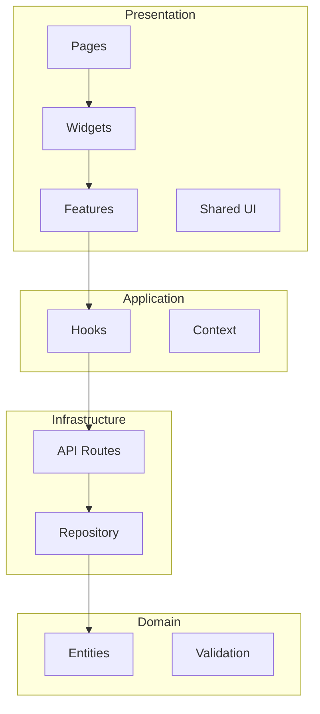

# Architecture

This document describes the architecture of the Todo List application.

## Overview

The app uses **Clean Architecture** with **Feature-Sliced Design** (FSD). Dependencies flow inward: UI → Application → Domain; Infrastructure implements persistence and API.



## Layers

### Presentation Layer

- **app/** – Next.js App Router: `page.tsx` (thin), `layout.tsx`, `error.tsx`, `loading.tsx`
- **widgets/** – Composite blocks (e.g. `TodoListWidget`) that orchestrate features
- **features/** – Feature-specific UI: `CreateTodoForm`, `TodoItem`, `TodoFilters`, `TodoCounter`
- **shared/ui/** – Reusable components: `Button`, `Input`, `Checkbox`, `Tabs`, `SearchInput`, `Spinner`, `ErrorMessage`

Presentation does not contain business logic; it calls hooks and renders data.

### Application Layer

- **shared/hooks/** – `useTodos` (TanStack Query + API calls)
- **providers/** – `UserProvider` (userId from localStorage), `Providers` (QueryClient + User)

Orchestration and server state live here; domain rules stay in entities.

### Domain Layer

- **entities/todo/** – Todo type, `CreateTodoDTO`, `UpdateTodoDTO`, `TodoStatus`
- **entities/todo/model/validation.ts** – `validateTodo`, `validateCreateTodoDTO`, `validateUpdateTodoDTO`, `ValidationError`

Domain is framework-agnostic and has no dependencies on React or Next.js.

### Infrastructure Layer

- **app/api/todos/** – REST handlers: GET, POST `/api/todos`; PATCH, DELETE `/api/todos/[id]`
- **entities/todo/repository/** – `TodoRepository` interface and in-memory implementation
- **shared/api/** – API client (`fetchTodos`, `createTodo`, `updateTodo`, `deleteTodo`)

## Folder Structure (FSD)

```
src/
├── app/
│   ├── api/todos/          # API routes
│   ├── page.tsx
│   ├── layout.tsx
│   ├── error.tsx
│   └── loading.tsx
├── entities/todo/
│   ├── types/
│   ├── model/validation.ts
│   ├── repository/
│   └── index.ts
├── features/
│   ├── create-todo/
│   ├── update-todo/
│   └── filter-todos/
├── shared/
│   ├── ui/
│   ├── api/
│   ├── hooks/
│   └── lib/
├── widgets/todo-list/
└── providers/
```

## Data Flow

1. User interacts with UI (e.g. CreateTodoForm).
2. Feature component calls a hook (e.g. `createTodo` from `useTodos`).
3. Hook uses TanStack Query mutation and `shared/api` to call the API.
4. API route uses `TodoRepository` and domain validation.
5. Repository updates in-memory store and returns the todo.
6. Response invalidates queries; UI re-renders with new data.

## Key Decisions

- **State**: Server state via TanStack Query; userId via React Context (localStorage).
- **Storage**: In-memory Map in the repository (no DB). Suitable for demo/single process; replace with DB for production.
- **Validation**: Shared in domain; API and repository both validate inputs.
- **Errors**: API returns `{ error, code }`; client shows messages and retry where applicable.
